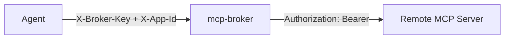

# mcp-broker

[](https://github.com/FirneyGroup/mcp-broker/actions/workflows/ci.yml)
[](LICENSE)
[](https://www.python.org/downloads/)

OAuth token broker and reverse proxy for remote MCP server connections.

> Built and maintained by [Firney](https://firney.com). Apache 2.0 licensed.

AI agents need to call tools on remote MCP servers (Notion, HubSpot, Reddit, Twitter/X), but those servers require OAuth credentials. The broker sits between your agent and remote servers, handling OAuth 2.1 flows and injecting tokens transparently so agents never see credentials.



## Table of Contents

- [How It Works](#how-it-works)
- [Features](#features)
- [Prerequisites](#prerequisites)
- [Installation](#installation)
- [Usage](#usage)
- [Docker](#docker)
- [Configuration](#configuration)
- [Key Management](#key-management)
- [Adding a Connector](#adding-a-connector)
- [API Reference](#api-reference)
- [Testing](#testing)
- [Security](#security)
- [Scaling & Multi-Instance](#scaling--multi-instance)
- [Contributing](#contributing)

## How It Works

```
┌─────────┐         ┌──────────────────────────────┐         ┌──────────────┐
│  Agent  │         │         mcp-broker            │         │  Remote MCP  │
│  (ADK)  │         │                               │         │   Server     │
│         │ ──────> │  1. Validate X-Broker-Key     │         │              │
│         │         │  2. Check scope + connector   │         │              │
│         │         │  3. Look up OAuth token       │ ──────> │              │
│         │         │  4. Inject Authorization hdr  │         │              │
│         │ <────── │  5. Stream response back      │ <────── │              │
└─────────┘         └──────────────────────────────┘         └──────────────┘
```

**Proxy flow**: Your agent sends MCP requests to the broker with an `X-Broker-Key` header. The broker validates the key, looks up the stored OAuth token for that connector, injects it as a `Bearer` token, and forwards the request. The response streams back unchanged.

**OAuth flow**: An operator runs `./start connect` to initiate an OAuth consent flow in a browser. The broker handles PKCE, state signing, code exchange, and token storage. Once connected, the agent can proxy requests without knowing about OAuth.

**Token lifecycle**: Tokens are encrypted at rest (MultiFernet) and refreshed automatically when they expire. A background loop proactively refreshes tokens approaching expiry.

## Features

- **OAuth 2.1 + PKCE** — Full authorization code flow with S256 code challenge for all connectors
- **OAuth discovery** — Automatic endpoint discovery ([RFC 8414](https://datatracker.ietf.org/doc/html/rfc8414)) and dynamic client registration ([RFC 7591](https://datatracker.ietf.org/doc/html/rfc7591)) for MCP servers that support it
- **Transparent token injection** — Your agent sends requests to the broker; the broker adds Bearer tokens before forwarding
- **Automatic token refresh** — Expired tokens are refreshed with locking to prevent concurrent refresh races
- **Proactive token refresh** — Background loop + admin API refreshes tokens expiring within 10 minutes
- **Encrypted token storage** — Tokens and dynamic registration credentials encrypted at rest with MultiFernet (supports key rotation)
- **Signed OAuth state** — HMAC-signed state parameter with single-use nonces and 10-minute expiry
- **Streaming proxy** — Passes through SSE and Streamable HTTP responses without buffering
- **Pluggable connectors** — Add new OAuth providers by subclassing `BaseConnector` with auto-registration
- **Hashed API keys** — Per-app broker keys stored as SHA-256 hashes, managed via admin API
- **Scope enforcement** — Per-app scopes (`proxy`, `status`) and connector access control
- **Connect tokens** — Single-use, time-limited tokens for browser OAuth (avoids key exposure in URLs)
- **Multi-tenant** — Per-app OAuth credentials scoped by `client_id:app_id`

## Prerequisites

- Python >= 3.11

## Installation

```bash
git clone https://github.com/FirneyGroup/mcp-broker.git
cd mcp-broker
uv sync --extra dev          # or: pip install -e ".[dev]"
```

Copy the example configuration files and fill in your secrets:

```bash
cp settings.example.yaml settings.yaml
cp .env.example .env
```

Generate an encryption key for token storage:

```bash
python -c "from cryptography.fernet import Fernet; print(Fernet.generate_key().decode())"
```

Add the output to `BROKER_ENCRYPTION_KEY` in `.env`.

## Usage

Start the broker (requires bash — Linux/macOS):

```bash
./start start
```

Or without the start script (any OS):

```bash
PYTHONPATH=src uvicorn broker.main:app --port 8002 --reload
```

Create an API key for your app (broker must be running):

```bash
./start create-key
```

Save the returned `br_*` key — it cannot be retrieved later.

Connect an OAuth provider interactively:

```bash
./start connect
```

Show configuration snippets for your MCP client:

```bash
./start mcp-config
```

## Docker

Build and run with Docker Compose:

```bash
docker compose up -d
```

The broker runs on port 8002 with data persisted in `./data/`. Configuration is mounted read-only from `settings.yaml`, and secrets are loaded from `.env`.

If you plan to use **sidecar connectors** (e.g. Google Workspace MCP, BigQuery), create the shared Docker network once before starting any sidecar:

```bash
docker network create sidecar-internal
```

Each sidecar under `sidecars/*` has its own `docker-compose.yml` and is deployed independently (`cd sidecars/<name> && docker compose up -d`). To put the broker on the same `sidecar-internal` network so it can reach sidecars, copy the provided override:

```bash
cp docker-compose.override.yml.example docker-compose.override.yml
docker compose up -d   # auto-merges base + override
```

The shipped `docker-compose.yml` lives at the repo root and runs the broker as a non-root user (`appuser`, UID 1000) on port 8002. For custom setups, extend it via `docker-compose.override.yml`.

## Configuration

Configuration is split between `settings.yaml` (structure) and `.env` (secrets). The YAML file supports `${VAR_NAME}` interpolation from environment variables.

### Environment Variables

| Variable | Description |
|----------|-------------|
| `BROKER_ADMIN_KEY` | Bootstrap secret for admin API (`X-Admin-Key` header) |
| `BROKER_ENCRYPTION_KEY` | MultiFernet key for encrypting tokens at rest |
| `BROKER_STATE_SECRET` | HMAC secret for signing OAuth state parameters |
| `{CONNECTOR}_CLIENT_ID` | OAuth client ID (static connectors only, e.g. `HUBSPOT_CLIENT_ID`, `GOOGLE_OAUTH_CLIENT_ID`, `LINKEDIN_CLIENT_ID`, `REDDIT_CLIENT_ID`, `TWITTER_CLIENT_ID`) |
| `{CONNECTOR}_CLIENT_SECRET` | OAuth client secret (matching pairs for each static connector above) |

See `.env.example` for the full list of supported connector env vars.

Per-app broker keys are managed via the admin API (`./start create-key`), not stored in YAML or `.env`.

Discovery connectors (e.g. Notion) don't need client ID/secret env vars — credentials are obtained via dynamic registration.

### settings.yaml

```yaml
broker:
  host: 0.0.0.0
  port: 8002
  log_level: INFO
  connectors: [hubspot, notion, workspace_mcp]
  admin_key: ${BROKER_ADMIN_KEY}
  encryption_keys:
    - ${BROKER_ENCRYPTION_KEY}
  state_secret: ${BROKER_STATE_SECRET}
  success_redirect_url: http://localhost:3000

store:
  backend: sqlite
  sqlite:
    db_path: ./data/tokens.db

# Per-app auth config — scopes and connector access control
clients:
  my_company:
    app1:
      scopes: [proxy, status]
      allowed_connectors: [hubspot, notion]  # empty list = all connectors

# Per-app OAuth credentials (static connectors only)
apps:
  my_company:
    app1:
      hubspot:
        client_id: ${HUBSPOT_CLIENT_ID}
        client_secret: ${HUBSPOT_CLIENT_SECRET}
```

## Key Management

API keys are managed via the admin API or CLI commands. Keys are stored as SHA-256 hashes — the raw key is shown once on creation and cannot be retrieved.

### CLI Commands

CLI commands require bash (Linux/macOS). The `./start` script auto-creates a virtualenv on first run.

```bash
./start generate-admin-key    # Generate BROKER_ADMIN_KEY (offline, no broker needed)
./start list-keys [url]       # List all apps and key status
./start create-key [url]      # Create key for an app (interactive)
./start rotate-key [url]      # Rotate an existing key (interactive)
./start delete-key [url]      # Delete a key (interactive, with confirmation)
```

All key commands (except `generate-admin-key`) require the broker to be running and `BROKER_ADMIN_KEY` set in `.env`. The optional `[url]` argument targets a remote broker instead of localhost.

### Admin API

| Method | Path | Description |
|--------|------|-------------|
| `POST` | `/admin/keys` | Create key (`{"app_key": "client:app"}`) |
| `GET` | `/admin/keys` | List all apps with `has_key` status |
| `POST` | `/admin/keys/{app_key}/rotate` | Rotate key (returns new key) |
| `DELETE` | `/admin/keys/{app_key}` | Delete key |
| `POST` | `/admin/connect-token` | Create single-use browser OAuth token |
| `POST` | `/admin/refresh` | Refresh all tokens expiring within 10 minutes |

All admin endpoints require the `X-Admin-Key` header.

## Adding a Connector

All connectors auto-register via `__init_subclass__` on import. Three flavours exist — pick one before writing code:

| Flavour | When to use | Where the MCP server runs | Where credentials come from |
|---------|-------------|---------------------------|------------------------------|
| **Static** | Upstream is a remote OAuth 2.1 MCP server, no RFC 8414 discovery | Remote (e.g. `https://mcp.example.com/mcp`) | `settings.yaml` `apps` section (client_id + client_secret) |
| **Discovery** | Upstream supports RFC 8414 discovery + RFC 7591 dynamic client registration | Remote | Auto-registered on first `/connect`; no `settings.yaml` entry |
| **Sidecar** | MCP server runs as a local Docker container next to the broker | Local (`http://<container>:8000/mcp`) | Either broker-managed OAuth (`auth_mode="broker"`) or sidecar-managed (`auth_mode="sidecar"`) — see `sidecars/_template/` |

If you're adding a sidecar, also see `sidecars/_template/README.md` for the full step-by-step including the `docker-compose.yml` and adapter skeletons.

### Static Connector (e.g. HubSpot)

Credentials configured manually in `settings.yaml`:

```python
from broker.connectors.base import BaseConnector
from broker.models.connector_config import ConnectorMeta

class MyConnector(BaseConnector):
    meta = ConnectorMeta(
        name="my_service",
        display_name="My Service",
        mcp_url="https://mcp.example.com/mcp",
        oauth_authorize_url="https://example.com/oauth/authorize",
        oauth_token_url="https://example.com/oauth/token",
        scopes=["read", "write"],
    )
```

1. Create `src/connectors/{name}/adapter.py` with the above
2. Override hooks only if the provider deviates from standard OAuth2
3. Add connector name to `connectors` list in `settings.yaml`
4. Add OAuth credentials to the `apps` section of `settings.yaml`

### Discovery Connector (e.g. Notion)

Endpoints discovered automatically, credentials obtained via dynamic registration:

```python
class MyMCPConnector(BaseConnector):
    meta = ConnectorMeta(
        name="my_mcp_service",
        display_name="My MCP Service",
        mcp_url="https://mcp.example.com/mcp",
        mcp_oauth_url="https://mcp.example.com",  # Triggers discovery path
    )
```

1. Create `src/connectors/{name}/adapter.py` — set `mcp_oauth_url` to trigger discovery
2. Override hooks if needed (e.g. `build_token_request_auth` for Basic Auth)
3. Add connector name to `connectors` list in `settings.yaml`
4. No credentials in `settings.yaml` — dynamic registration handles it

### Sidecar Connector (e.g. Google Workspace)

The broker manages OAuth, but the MCP server runs as a local Docker container:

```python
class WorkspaceMcpConnector(BaseConnector):
    meta = ConnectorMeta(
        name="workspace_mcp",
        display_name="Google Workspace",
        mcp_url="http://workspace-mcp:8000/mcp",
        auth_mode="broker",
        oauth_authorize_url="https://accounts.google.com/o/oauth2/v2/auth",
        oauth_token_url="https://oauth2.googleapis.com/token",
        scopes=["openid", "email", "..."],
    )
```

1. Create `src/connectors/{name}/adapter.py` with `auth_mode="broker"`
2. Create `sidecars/{name}/docker-compose.yml` with `EXTERNAL_OAUTH21_PROVIDER=true`
3. Add OAuth credentials to `.env` and `settings.yaml`

## API Reference

### Proxy

| Method | Path | Auth | Description |
|--------|------|------|-------------|
| `GET/POST/PUT/DELETE` | `/proxy/{connector}/{path}` | `X-Broker-Key` + `X-App-Id` | Forward request to remote MCP server with token injection |

### OAuth

| Method | Path | Auth | Description |
|--------|------|------|-------------|
| `GET` | `/oauth/{connector}/connect` | Headers or `connect_token` query param | Start OAuth authorization flow |
| `GET` | `/oauth/{connector}/callback` | Signed state | OAuth callback (called by provider) |
| `POST` | `/oauth/{connector}/disconnect` | `X-Broker-Key` + `X-App-Id` | Delete stored token |

The `/connect` endpoint supports two auth modes:
- **API client**: `X-App-Id` + `X-Broker-Key` headers
- **Browser**: `connect_token` query param (from `POST /admin/connect-token`, single-use, 5-minute TTL)

### Status

| Method | Path | Auth | Description |
|--------|------|------|-------------|
| `GET` | `/status` | `X-Broker-Key` + `X-App-Id` | List connections and token health for an app |
| `GET` | `/health` | None | Health check with registered connectors |

## Testing

```bash
./start test
```

Or directly:

```bash
uv run pytest tests/ -v
```

## Security

The broker implements defense-in-depth for OAuth credential management:

- **API keys hashed at rest** — SHA-256. Raw key shown once on creation, never retrievable.
- **Tokens encrypted at rest** — MultiFernet encryption with key rotation support
- **PKCE (S256)** — All OAuth flows use Proof Key for Code Exchange
- **Signed state parameters** — HMAC-signed with single-use nonces and 10-minute expiry
- **Per-app key isolation** — Compromised broker key only affects that app's tokens
- **Scope enforcement** — `proxy` and `status` scopes checked at every endpoint
- **Connector access control** — `allowed_connectors` restricts which connectors an app can reach
- **Connect tokens** — Single-use, 5-minute TTL tokens for browser OAuth (avoids raw key in URLs, browser history, and proxy logs)
- **Identity substitution prevention** — Middleware cross-checks verified key against claimed `X-App-Id`
- **Internal headers stripped** — `X-Broker-Key`, `X-App-Id`, `Authorization` never forwarded to remote servers
- **Timing-safe comparison** — `hmac.compare_digest` for admin key validation
- **SSRF prevention** — Discovery rejects private/loopback addresses

### Known Limitations

- **No rate limiting** — Consider [slowapi](https://github.com/laurents/slowapi) or an upstream reverse proxy for production.
- **Single-instance state** — OAuth nonces, PKCE verifiers, and connect tokens are in-memory. Multi-instance deployments require shared storage (see [Scaling & Multi-Instance](#scaling--multi-instance)).

See [SECURITY.md](SECURITY.md) for vulnerability reporting.

## Scaling & Multi-Instance

Current architecture is single-instance with SQLite. The `TokenStore` and `BrokerKeyStore` ABCs are designed for backend swapping.

### Current Architecture

| Component | Implementation | Constraint |
|-----------|---------------|------------|
| Token store | SQLite + MultiFernet encryption | Single-instance |
| Key store | SQLite + SHA-256 hashing | Single-instance |
| Registration store | SQLite + MultiFernet encryption | Single-instance |
| Refresh locks | `asyncio.Lock` | Single-process |
| Nonce tracking | In-memory set | Single-process |
| Connect tokens | In-memory dict | Single-process |
| Discovery cache | In-memory dict | Per-instance |

### Multi-Instance Path

1. **Shared token + key store** — Implement the ABCs with PostgreSQL, Redis, or Firestore
2. **Distributed locks** — Replace `asyncio.Lock` with database transactions or distributed locks
3. **Shared nonce storage** — Move `_consumed_nonces` and `_pkce_verifiers` to shared store
4. **Shared connect tokens** — Move `ConnectTokenStore` to shared store with TTL

## Contributing

See [CONTRIBUTING.md](CONTRIBUTING.md) for development setup, PR process, and code style. This project adopts the [Contributor Covenant v2.1](CODE_OF_CONDUCT.md). Security issues follow the private-reporting flow in [SECURITY.md](SECURITY.md).

## License

Licensed under the Apache License, Version 2.0. See [LICENSE](LICENSE) for details.
Copyright 2026 Firney Ltd.
