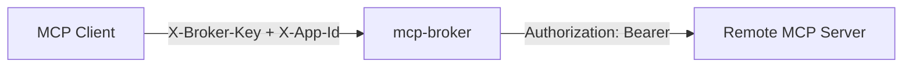
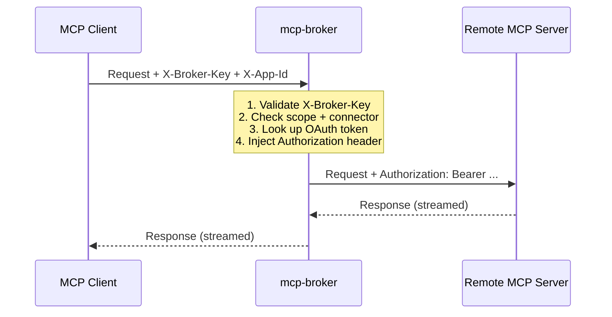

# mcp-broker

[](https://github.com/FirneyGroup/mcp-broker/actions/workflows/ci.yml)
[](LICENSE)
[](https://www.python.org/downloads/)

OAuth token broker and reverse proxy for remote MCP server connections.

> Built and maintained by [Firney](https://firney.com). Apache 2.0 licensed.

AI agents need to call tools on remote MCP servers (Notion, HubSpot, Reddit, Twitter/X), but those servers require OAuth credentials. The broker sits between your agent and remote servers, handling OAuth 2.1 flows and injecting tokens transparently so agents never see credentials.



Works with any MCP-compatible client (Claude Desktop, Claude Code, Google ADK, custom agents).

## Is this for me?

**Use mcp-broker if you:**
- Operate multiple AI agents or apps that need OAuth access to the same set of third-party services (Notion, HubSpot, Google Workspace, etc.)
- Want per-app credential isolation — compromising one app's broker key should not expose the others
- Prefer agents that never touch raw OAuth tokens or client secrets
- Need to drop in new OAuth providers without redeploying every agent that uses them
- Want to author custom MCP tools — wrap a Python SDK or expose internal APIs via a native connector, without standing up a separate MCP server

**Skip mcp-broker if you:**
- Have a single agent with a single hardcoded credential — a `.env` var is simpler
- Need a full identity provider with user authentication — use Keycloak, Auth0, or similar

## Table of Contents

- [Quickstart](#quickstart)
- [How It Works](#how-it-works)
- [Features](#features)
- [Prerequisites](#prerequisites)
- [Installation](#installation)
- [Usage](#usage)
- [Docker](#docker)
- [Configuration](#configuration)
- [Key Management](#key-management)
- [Adding a Connector](#adding-a-connector)
- [API Reference](#api-reference)
- [Testing](#testing)
- [Security](#security)
- [Scaling & Multi-Instance](#scaling--multi-instance)
- [API Stability](#api-stability)
- [Contributing](#contributing)

## Quickstart

Stand up the broker, connect your first OAuth provider (Notion — no credentials needed thanks to RFC 7591 dynamic registration), and make your first proxied MCP request in about five minutes.

```bash
# 1. Clone and install
git clone https://github.com/FirneyGroup/mcp-broker.git
cd mcp-broker
uv sync --extra dev

# 2. Write a fresh .env with the three required secrets
cat > .env <<EOF
BROKER_ADMIN_KEY=$(python -c 'import secrets; print(secrets.token_urlsafe(32))')
BROKER_ENCRYPTION_KEY=$(python -c 'from cryptography.fernet import Fernet; print(Fernet.generate_key().decode())')
BROKER_STATE_SECRET=$(python -c 'import secrets; print(secrets.token_urlsafe(32))')
EOF

# 3. Start from the example YAML (includes a demo app 'my_company:app1' and 'notion' connector)
cp settings.example.yaml settings.yaml
./start start &

# 4. Create a broker key for the demo app
./start create-key
# Choose 'my_company:app1' — copy the br_* key that prints

# 5. Connect Notion (opens browser for OAuth consent)
./start connect
# Choose 'notion'

# 6. Make your first proxied MCP call (paste the key from step 4 below)
export BROKER_KEY="<paste-broker-key-from-step-4>"
curl -s -X POST \
  -H "X-Broker-Key: $BROKER_KEY" \
  -H "X-App-Id: my_company:app1" \
  -H "Content-Type: application/json" \
  -d '{"jsonrpc":"2.0","method":"tools/list","id":1}' \
  http://localhost:8002/proxy/notion/mcp | python3 -m json.tool
```

You should see Notion's tool catalogue. Point any MCP client at `http://localhost:8002/proxy/notion/mcp` with the same headers and it can now call Notion without ever seeing an OAuth token.

Next: [connect more services](#adding-a-connector), [wire the broker into an agent](#api-reference), or [harden the deployment](#security).

## How It Works



**Proxy flow**: Your MCP client sends MCP requests to the broker with an `X-Broker-Key` header. The broker validates the key, looks up the stored OAuth token for that connector, injects it as a `Bearer` token, and forwards the request. The response streams back unchanged.

**OAuth flow**: An operator runs `./start connect` to initiate an OAuth consent flow in a browser. The broker handles PKCE, state signing, code exchange, and token storage. Once connected, the client can proxy requests without knowing about OAuth.

**Token lifecycle**: Tokens are encrypted at rest (MultiFernet) and refreshed automatically when they expire. A background loop proactively refreshes tokens approaching expiry.

**Native flow**: Some connectors (e.g. Twitter/X) implement MCP tools directly inside the broker — no upstream server. The broker validates, looks up the access token, and dispatches to a tool handler in-process. From the client's perspective the protocol is identical to the proxy flow.

## Features

- **OAuth 2.1 + PKCE** — Full authorization code flow with S256 code challenge for all connectors
- **OAuth discovery** — Automatic endpoint discovery ([RFC 8414](https://datatracker.ietf.org/doc/html/rfc8414)) and dynamic client registration ([RFC 7591](https://datatracker.ietf.org/doc/html/rfc7591)) for MCP servers that support it
- **Transparent token injection** — Your agent sends requests to the broker; the broker adds Bearer tokens before forwarding
- **Automatic token refresh** — Expired tokens are refreshed with locking to prevent concurrent refresh races
- **Proactive token refresh** — Background loop + admin API refreshes tokens expiring within 10 minutes
- **Encrypted token storage** — Tokens and dynamic registration credentials encrypted at rest with MultiFernet (supports key rotation)
- **Signed OAuth state** — HMAC-signed state parameter with single-use nonces and 10-minute expiry
- **Streaming proxy** — Passes through SSE and Streamable HTTP responses without buffering
- **Pluggable connectors** — Add new OAuth providers by subclassing `BaseConnector` (remote upstreams) or `NativeConnector` (tools implemented in-process); both auto-register on import
- **Hashed API keys** — Per-app broker keys stored as SHA-256 hashes, managed via admin API
- **Scope enforcement** — Per-app scopes (`proxy`, `status`) and connector access control
- **Connect tokens** — Single-use, time-limited tokens for browser OAuth (avoids key exposure in URLs)
- **Multi-tenant** — Per-app OAuth credentials scoped by `client_id:app_id`

## Prerequisites

- Python >= 3.11

## Installation

```bash
git clone https://github.com/FirneyGroup/mcp-broker.git
cd mcp-broker
uv sync --extra dev          # or: pip install -e ".[dev]"
```

Copy the example configuration files and fill in your secrets:

```bash
cp settings.example.yaml settings.yaml
cp .env.example .env
```

Generate an encryption key for token storage:

```bash
python -c "from cryptography.fernet import Fernet; print(Fernet.generate_key().decode())"
```

Add the output to `BROKER_ENCRYPTION_KEY` in `.env`.

## Usage

Start the broker (requires bash — Linux/macOS):

```bash
./start start
```

Or without the start script (any OS):

```bash
PYTHONPATH=src uvicorn broker.main:app --port 8002 --reload
```

Create an API key for your app (broker must be running):

```bash
./start create-key
```

Save the returned `br_*` key — it cannot be retrieved later.

Connect an OAuth provider interactively:

```bash
./start connect
```

Show configuration snippets for your MCP client:

```bash
./start mcp-config
```

## Docker

Build and run with Docker Compose:

```bash
docker compose up -d
```

The broker runs on port 8002 with data persisted in `./data/`. Configuration is mounted read-only from `settings.yaml`, and secrets are loaded from `.env`.

The shipped `docker-compose.yml` runs the broker as a non-root user (`appuser`, UID 1000) on port 8002.

If you plan to use **sidecar connectors** (e.g. Google Workspace MCP, BigQuery):

1. Create the shared network once: `docker network create sidecar-internal`
2. Uncomment the `networks` blocks in `docker-compose.yml` so the broker joins `sidecar-internal`
3. Each sidecar lives under `sidecars/*` with its own `docker-compose.yml` and is deployed independently: `cd sidecars/<name> && docker compose up -d`

## Configuration

Configuration is split between `settings.yaml` (structure) and `.env` (secrets). The YAML file supports `${VAR_NAME}` interpolation from environment variables.

### Environment Variables

| Variable | Description |
|----------|-------------|
| `BROKER_ADMIN_KEY` | Bootstrap secret for admin API (`X-Admin-Key` header) |
| `BROKER_ENCRYPTION_KEY` | MultiFernet key for encrypting tokens at rest |
| `BROKER_STATE_SECRET` | HMAC secret for signing OAuth state parameters |
| `{CONNECTOR}_CLIENT_ID` | OAuth client ID (static connectors only, e.g. `HUBSPOT_CLIENT_ID`, `GOOGLE_OAUTH_CLIENT_ID`, `LINKEDIN_CLIENT_ID`, `REDDIT_CLIENT_ID`, `TWITTER_CLIENT_ID`) |
| `{CONNECTOR}_CLIENT_SECRET` | OAuth client secret (matching pairs for each static connector above) |

See `.env.example` for the full list of supported connector env vars.

Per-app broker keys are managed via the admin API (`./start create-key`), not stored in YAML or `.env`.

Discovery connectors (e.g. Notion) don't need client ID/secret env vars — credentials are obtained via dynamic registration.

### settings.yaml

```yaml
broker:
  host: 0.0.0.0
  port: 8002
  log_level: INFO
  connectors: [hubspot, notion, workspace_mcp]
  admin_key: ${BROKER_ADMIN_KEY}
  encryption_keys:
    - ${BROKER_ENCRYPTION_KEY}
  state_secret: ${BROKER_STATE_SECRET}
  success_redirect_url: http://localhost:3000

store:
  backend: sqlite
  sqlite:
    db_path: ./data/tokens.db

# Per-app auth config — scopes and connector access control
clients:
  my_company:
    app1:
      scopes: [proxy, status]
      allowed_connectors: [hubspot, notion]  # empty list = all connectors

# Per-app OAuth credentials (static connectors only)
apps:
  my_company:
    app1:
      hubspot:
        client_id: ${HUBSPOT_CLIENT_ID}
        client_secret: ${HUBSPOT_CLIENT_SECRET}
```

## Key Management

API keys are managed via the admin API or CLI commands. Keys are stored as SHA-256 hashes — the raw key is shown once on creation and cannot be retrieved.

### CLI Commands

CLI commands require bash (Linux/macOS). The `./start` script auto-creates a virtualenv on first run.

```bash
./start generate-admin-key    # Generate BROKER_ADMIN_KEY (offline, no broker needed)
./start list-keys [url]       # List all apps and key status
./start create-key [url]      # Create key for an app (interactive)
./start rotate-key [url]      # Rotate an existing key (interactive)
./start delete-key [url]      # Delete a key (interactive, with confirmation)
```

All key commands (except `generate-admin-key`) require the broker to be running and `BROKER_ADMIN_KEY` set in `.env`. The optional `[url]` argument targets a remote broker instead of localhost.

### Admin API

| Method | Path | Description |
|--------|------|-------------|
| `POST` | `/admin/keys` | Create key (`{"app_key": "client:app"}`) |
| `GET` | `/admin/keys` | List all apps with `has_key` status |
| `POST` | `/admin/keys/{app_key}/rotate` | Rotate key (returns new key) |
| `DELETE` | `/admin/keys/{app_key}` | Delete key |
| `POST` | `/admin/connect-token` | Create single-use browser OAuth token |
| `POST` | `/admin/refresh` | Refresh all tokens expiring within 10 minutes |

All admin endpoints require the `X-Admin-Key` header.

## Adding a Connector

All connectors auto-register via `__init_subclass__` on import. Four flavours exist — pick one before writing code:

| Flavour | When to use | Where the MCP server runs | Where credentials come from |
|---------|-------------|---------------------------|------------------------------|
| **Static** | Remote OAuth 2.1 MCP server with fixed endpoints | Remote (e.g. `https://mcp.example.com/mcp`) | `settings.yaml` `apps` section (client_id + client_secret) |
| **Discovery** | Remote MCP server supporting RFC 8414 + RFC 7591 | Remote | Auto-registered on first `/connect`; no `settings.yaml` entry |
| **Sidecar** | MCP server runs as a local Docker container next to the broker | Local (`http://<container>:8000/mcp`) | Either broker-managed OAuth (`auth_mode="broker"`) or sidecar-managed (`auth_mode="sidecar"`) |
| **Native** | No MCP server exists — wrap a provider's SDK / REST API in-process | In-process (broker serves MCP directly) | `settings.yaml` `apps` section; broker passes access tokens to each tool handler |

**Quick start:**

1. Read [AGENTS.md § Provider Onboarding](AGENTS.md#provider-onboarding) and pick a flavour by running the probes.
2. Copy the matching template from `src/connectors/_template/{flavour}/` to `src/connectors/{your_name}/`.
3. Rename the class, replace every `FILL_ME_IN`, and follow `SETUP.md` in the copied directory.
4. Add `{your_name}` to `broker.connectors` in `settings.example.yaml` (and `apps` entries for Static / Sidecar-broker / Native).
5. Add a test at `tests/test_{your_name}_connector.py`.
6. Run `pytest tests/ -v` — all green before opening a PR.

**Reference examples:**

- Static → `src/connectors/hubspot/adapter.py`
- Discovery → `src/connectors/notion/adapter.py` (HTTP Basic Auth + Notion-Version header)
- Sidecar → `src/connectors/workspace_mcp/adapter.py` + `sidecars/workspace-mcp/`
- Native → `src/connectors/twitter/adapter.py` (xdk SDK wrapped with `run_in_executor`)

**Reviewers check against** [AGENTS.md § Connector Rules](AGENTS.md#connector-rules-must) — every `MUST` in that section is enforced on PR review.

## API Reference

### Proxy

| Method | Path | Auth | Description |
|--------|------|------|-------------|
| `GET/POST/PUT/DELETE` | `/proxy/{connector}/{path}` | `X-Broker-Key` + `X-App-Id` | Forward request to remote MCP server with token injection |

### OAuth

| Method | Path | Auth | Description |
|--------|------|------|-------------|
| `GET` | `/oauth/{connector}/connect` | Headers or `connect_token` query param | Start OAuth authorization flow |
| `GET` | `/oauth/{connector}/callback` | Signed state | OAuth callback (called by provider) |
| `POST` | `/oauth/{connector}/disconnect` | `X-Broker-Key` + `X-App-Id` | Delete stored token |

The `/connect` endpoint supports two auth modes:
- **API client**: `X-App-Id` + `X-Broker-Key` headers
- **Browser**: `connect_token` query param (from `POST /admin/connect-token`, single-use, 5-minute TTL)

### Status

| Method | Path | Auth | Description |
|--------|------|------|-------------|
| `GET` | `/status` | `X-Broker-Key` + `X-App-Id` | List connections and token health for an app |
| `GET` | `/health` | None | Health check with registered connectors |

## Testing

```bash
./start test
```

Or directly:

```bash
uv run pytest tests/ -v
```

## Security

The broker implements defense-in-depth for OAuth credential management:

- **API keys hashed at rest** — SHA-256. Raw key shown once on creation, never retrievable.
- **Tokens encrypted at rest** — MultiFernet encryption with key rotation support
- **PKCE (S256)** — All OAuth flows use Proof Key for Code Exchange
- **Signed state parameters** — HMAC-signed with single-use nonces and 10-minute expiry
- **Per-app key isolation** — Compromised broker key only affects that app's tokens
- **Scope enforcement** — `proxy` and `status` scopes checked at every endpoint
- **Connector access control** — `allowed_connectors` restricts which connectors an app can reach
- **Connect tokens** — Single-use, 5-minute TTL tokens for browser OAuth (avoids raw key in URLs, browser history, and proxy logs)
- **Identity substitution prevention** — Middleware cross-checks verified key against claimed `X-App-Id`
- **Internal headers stripped** — `X-Broker-Key`, `X-App-Id`, `Authorization` never forwarded to remote servers
- **Timing-safe comparison** — `hmac.compare_digest` for admin key validation
- **SSRF prevention** — Discovery rejects private/loopback addresses

### Known Limitations

- **No rate limiting** — Consider [slowapi](https://github.com/laurents/slowapi) or an upstream reverse proxy for production.
- **Single-instance state** — OAuth nonces, PKCE verifiers, and connect tokens are in-memory. Multi-instance deployments require shared storage (see [Scaling & Multi-Instance](#scaling--multi-instance)).

See [SECURITY.md](SECURITY.md) for vulnerability reporting.

## Scaling & Multi-Instance

Current architecture is single-instance with SQLite. The `TokenStore` and `BrokerKeyStore` ABCs are designed for backend swapping.

### Current Architecture

| Component | Implementation | Constraint |
|-----------|---------------|------------|
| Token store | SQLite + MultiFernet encryption | Single-instance |
| Key store | SQLite + SHA-256 hashing | Single-instance |
| Registration store | SQLite + MultiFernet encryption | Single-instance |
| Refresh locks | `asyncio.Lock` | Single-process |
| Nonce tracking | In-memory set | Single-process |
| Connect tokens | In-memory dict | Single-process |
| Discovery cache | In-memory dict | Per-instance |

### Multi-Instance Path

1. **Shared token + key store** — Implement the ABCs with PostgreSQL, Redis, or Firestore
2. **Distributed locks** — Replace `asyncio.Lock` with database transactions or distributed locks
3. **Shared nonce storage** — Move `_consumed_nonces` and `_pkce_verifiers` to shared store
4. **Shared connect tokens** — Move `ConnectTokenStore` to shared store with TTL

## API Stability

**This project is pre-1.0.** Minor version bumps (`0.x` → `0.y`) may contain breaking changes to:

- The HTTP API surface (`/proxy`, `/oauth`, `/admin`, `/status`)
- The `BaseConnector` extension contract and `ConnectorMeta` fields
- `settings.yaml` schema and environment variable names
- The `./start` CLI subcommands and output formats

Patch bumps (`0.x.y` → `0.x.z`) are bug fixes and documentation only — safe to upgrade.

In production, **pin to a specific tag** (e.g. `git clone --branch v0.1.0` or `pip install mcp-broker==0.1.0` once published) rather than tracking `main`. The [CHANGELOG](CHANGELOG.md) documents every breaking change.

The 1.0 release will signal stable HTTP and connector APIs with semver-honest compatibility guarantees going forward.

## Contributing

See [CONTRIBUTING.md](CONTRIBUTING.md) for development setup, PR process, and code style. This project adopts the [Contributor Covenant v2.1](CODE_OF_CONDUCT.md). Security issues follow the private-reporting flow in [SECURITY.md](SECURITY.md).

## License

Licensed under the Apache License, Version 2.0. See [LICENSE](LICENSE) for details.
Copyright 2026 Firney Ltd.
